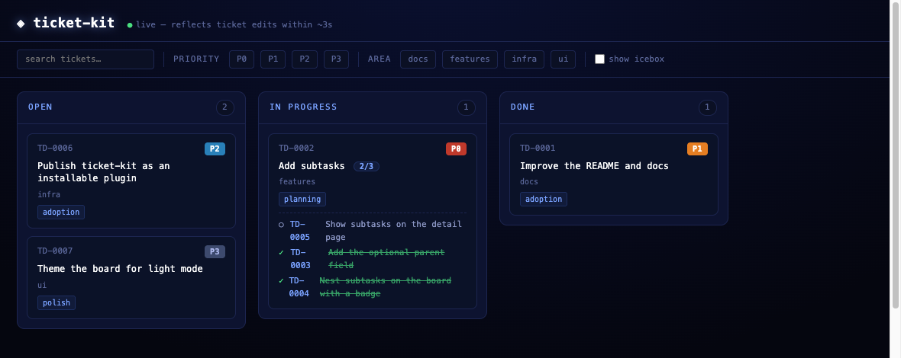

# ticket-kit

An **AI-first ticket system**: Claude authors and grooms your tickets, you watch
them move on a live board. Every ticket is a markdown file with YAML frontmatter,
a tiny zero-dependency CLI serves a neon board, and the board is **read-only** —
changes happen by editing files (by the AI or by you), so your git history *is*
the audit log. It installs as a Claude Code plugin and drops into any project.

## Quick start

Requires Node ≥ 22 (built-in TypeScript type-stripping — nothing to `npm install`
to run it). Grab the repo:

```bash
git clone https://github.com/chadfurman/ticket-kit
cd ticket-kit
```

Install the plugin so Claude can manage the tickets — both are slash commands in
Claude Code:

```
/plugin marketplace add chadfurman/ticket-kit
/plugin install ticket-kit@ticket-kit
```

Now make a ticket — ask Claude *"make a ticket to add dark mode"*, or scaffold one
yourself — then start the board:

```bash
node src/cli.ts new "my first ticket"   # or let the ticket-author agent do it
node src/cli.ts serve                    # → http://localhost:4317
```

Open **http://localhost:4317** and you're looking at the live, read-only board:



## Install into a project

ticket-kit is **stateless logic** — copy `src/` in and the host owns its data
(`tickets/*.md` + an optional `.tickets.json`):

```bash
cp -r ticket-kit/src my-project/tools/tickets
cd my-project
node tools/tickets/cli.ts serve          # board for THIS project's tickets/
```

Optionally add scripts to your `package.json`:

```json
{ "scripts": { "tickets": "node tools/tickets/cli.ts", "tickets:serve": "node tools/tickets/cli.ts serve" } }
```

## The plugin

Installed in the quick-start above, the plugin gives you a `/tickets` command and
two agents: **ticket-author** (turns an idea or bug into a well-formed ticket) and
**ticket-groomer** (triages the board — re-ranks, unblocks, answers "what should I
work on next").

It works from a **private** repo: `/plugin marketplace add` clones the GitHub
source with your existing `git` / `gh` credentials, so any repo you can access,
you can install.

## The ticket format

```yaml
---
id: TD-0001              # PREFIX-NNNN, matches the filename
title: Short imperative title
status: open             # a column key, or "icebox" (hidden until promoted)
priority: P0             # one of the configured priorities (P0 = most urgent)
rank: 20                 # tie-breaker within column+priority; lower floats higher
area: web                # free-form domain tag
pillars: [low-stress]    # optional project themes
blocked-by: [TD-0003]    # ids this waits on
parent: TD-0002          # OPTIONAL — makes this a subtask of TD-0002
created: 2026-06-08
---
```

**Subtasks:** give a ticket a `parent:` and it renders nested under that parent's
card, which shows a `[done/total]` badge. `parent` is optional — tickets without
it work unchanged. Create one with `node src/cli.ts new "the subtask" --parent TD-0002`.

Board sort order: **column → priority → rank → id**. `status: icebox` keeps a
ticket off the board (toggle "show icebox" on the live view).

## Commands

| Command | What it does |
| --- | --- |
| `ticket-kit serve` | Live board (polls files ~3s); cards open a rendered detail page. |
| `ticket-kit generate` | Rewrite the README index + static `board.html`. |
| `ticket-kit new "<title>"` | Scaffold a ticket. `--priority --area --status --parent`. |
| `ticket-kit check` | Validate all frontmatter; exits non-zero on problems (CI guard). |
| `ticket-kit migrate` | Upgrade tickets to the current data schema. |
| `ticket-kit version` | Print the kit + data-schema versions. |

Drop a `.tickets.json` at your project root to override `title`, `ticketsDir`,
`port`, `idPrefix`, `priorities`, or `columns`. All optional.

## Updating ticket-kit

The kit is **code**; your tickets are **data**. Updating one never touches the
other — except through a declared migration.

```bash
cp -r ticket-kit/src my-project/tools/tickets   # re-copy the logic; data untouched
ticket-kit check                                # compatibility gate
ticket-kit migrate                              # only if check says the schema is older
ticket-kit generate                             # refresh the index/board
```

`KIT_VERSION` (code) and `SCHEMA_VERSION` (data contract) are independent.
`check` is the guard: it **errors** if your data's schema is newer than the kit,
and **prompts `migrate`** if it's older — so an update can never silently corrupt
your tickets. Details in [`CLAUDE.md`](CLAUDE.md) § "The data contract".

## Contributing

```bash
npm install          # dev-only: typescript + @types/node (runtime needs nothing)
npm test             # node:test suite
npm run typecheck    # tsc --noEmit
```

Both must stay green. Keep it zero-runtime-dependency, functions ≤ 50 lines, and
all HTML through `escapeHtml`. Breaking changes to the data contract require a
`SCHEMA_VERSION` bump **and** a migration in the same commit — see `CLAUDE.md`.

## License

[MIT](LICENSE) © Chad Furman.
